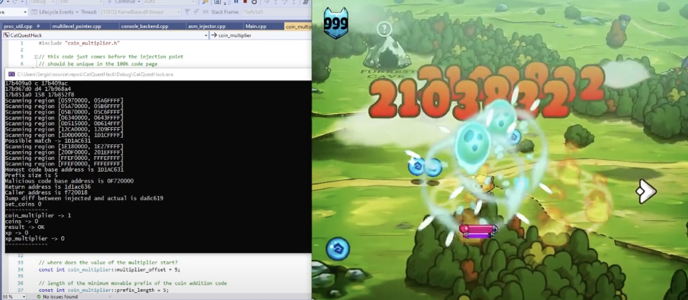

# CatQuestHack

A console hack for the Cat Quest Game. It has the following features:
- Coin Multiplier (multiplies the value of the coins you pick by X, quest rewards are not affected)
- XP Multiplier (multiplies the value of the XP you get by X, quest rewards are not affected)
- Change the Coin value to whatever you want

# How to use it
Start the cheat ONLY IF Cat Quest is already running. The cheat requires you to pick at least one coin or one xp ball to work.
Once its working you should read two messages on the console saying that code injections were succesful. Now you can use the following commands

- set_coin_multiplier value
- set_xp_multiplier value
- set_coins value

which are pretty self-explanatory.

You cannot close and re-open the cheat during the same game session, it won't work. You should either keep playing the game without being able to modify the multipliers or the number of coins you have anymore, or close the game and open it again. Multipliers will still have effect even if the cheat has been closed.

# Additional comments
This is the first game cheat I ever made without using already existing libraries. All of the code is 100% mine, except for maybe some small copypastes dealing with Windows API. There are better libraries to do the same thing my code does, but feel free to use, copy and do whatever you want with it, but mention me if you do :)

I wrote this because I always wanted to get into game hacking and I decided to jump in recently. Addresses and ASM codes were found with the help of Cheat Engine, as you may have guessed.

If you use this cheat and does not work in your machine, let me know. I would like to test it on other Windows machine, but I do not have more than one in my house.
